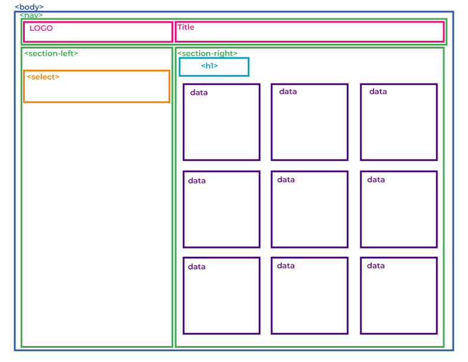
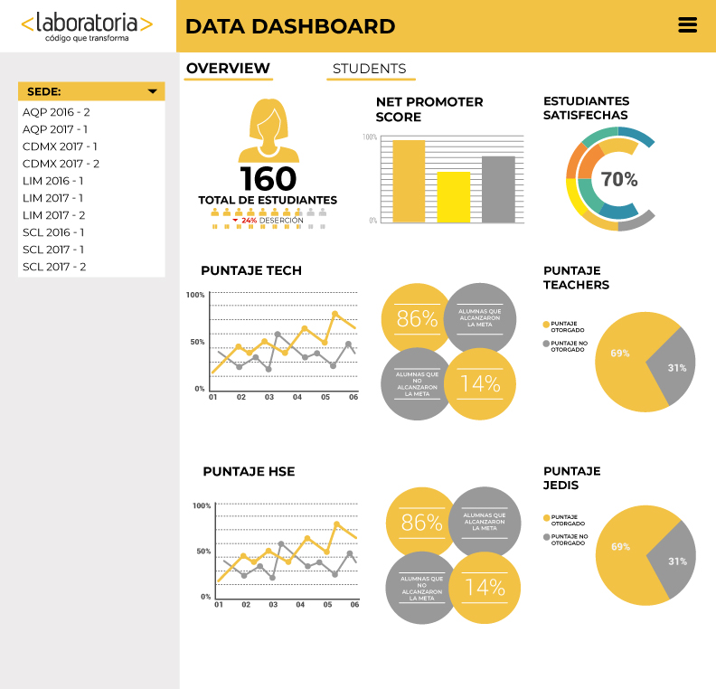

## CODERS:
```
Aidé Iyali Marquez Lago
Arinta Osorio Valladares
Cristina Nayelli Canchola Lara

   ```
# Data Dashboard

* **Track:** _Common Core_
* **Curso:** _Creando tu primer sitio web interactivo_
* **Unidad:** _Producto final_

***

## Flujo de trabajo

1. Debes realizar un [**fork**](https://gist.github.com/ivandevp/1de47ae69a5e139a6622d78c882e1f74)
   de este repositorio.

2. Luego deberás **clonar** tu fork en tu máquina. Recuerda que el comando a usar
   es `git clone` y su estructura normalmente se ve así:

   ```bash
   git clone https://github.com/<nombre-de-usuario>/freelancer.git
   ```

3. Cuando hayas terminado tu producto, envía un Pull Request a este repositorio
   (puedes solicitar apoyo de tus profes para este paso).

> Nota: No olvides que es una buena práctica describir tu proyecto en este
> archivo `README.md` y también desplegar tu web a Github Pages :smiley:.


# Data Dashboard

El siguiente dashboard tiene el objetivo de presentar una serie de indicadores
que permitan tomar decisiones para mejorar los servicios de Laboatoria. 

## Flujo de trabajo

1. Realizar un sketch donde se ubiquen los elementos que contengan los datos
de mayor relevancia para el cliente y los elementos dinámicos.
2. Realizar el maquetado. (HTML y CSS)
    - 2.1.dentificar elementos fijos.
    - 2.2. Identificar espacios para creación de elementos en el DOM.
3. Analizar la base de datos.
4. Realizar un diagrama de flujo.
5. Realizar partes dinámicas.
    - 5.1. Realizar evento sobre el Tag 'select', para que al hacer click sobre el, se muestren algunos datos estadísticos, contenidos en la función [clicOption].
    - 5.2. Acceder a las propiedades de la data y guardarlo en las variables.
    - 5.3. Proceder a elaborar las operaciones respectivas con dichos datos:
        - Obtener el total de alumnas por sede y generación.
        - Obtener el total de alumnas activas por sede y generación.
        - Obtener el total inactivas.
        - Obtener el porcentaje de alumnas inactivas por sede y generación.
        - Obtener el promedio total en HSE.
        - Obtener el promedio total en Tech.
        - Obtener NPS.
        - Obtner la cantidad y porcentaje de estudiantes que superan la meta en puntos técnicos en promedio y por sprint.
        - Obtener la cantidad y el porcentaje que representa el total de estudiantes que superan la meta de puntos de HSE en promedio y por sprint.
        - Obtner el porcentaje de estudiantes satisfechas con la experiencia de Laboratoria.
        - Obtener promedio de los profesores.
        - Obtener promedio de los jedi masters.
6. Crear los elementos del DOM que van a contener los resultados de las operaciones. Estos elementos quedaran contenidos en el id "section-right".
7. Realizar el sketch de la página secundaria, donde se muestren los datos individuales de las alumnas.
8. Realizar el maquetado.
9. Realizar los elementos dinámicos.
        9.1. Realizar un evento en el botton "estudiantes", contenido en el navegador de la página principal, para que al darle click, envíe a la página del punto anterior.
        9.2. Realizar una función que permita mostrar en la segunda página, los datos de las alumnas por sede y generación.


## MAQUETADO




## Sketch



## Tipografía


## Paleta de colores

